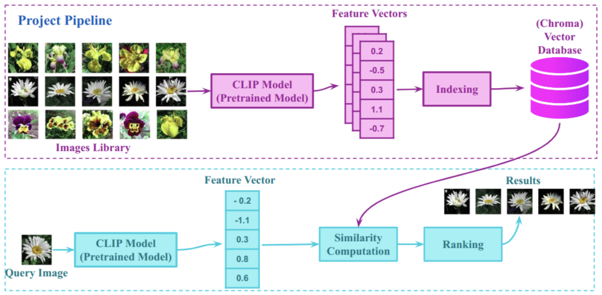

# image-retrieval

## Streamlit application

1. Upload an image
2. Search results shows on the right handside.


## Image retrieval framework


The application use ChromaDB for vector similarity search. The pipeline as follow:
1. Indexing image by using embedding `OpenCLIPEmbeddingFunction`
```python
embedding = embedding_function._encode_image(image=np.array(image))
```

2. Initialize ChromaDB client to persist embedded images.
```python
# Persistent client to store indexed images
chromadb.PersistentClient(path="./chromadb/persisted")
```

```bash
# disk usage (du -ha chromadb)
3.0M    chromadb/persisted/chroma.sqlite3
2.1M    chromadb/persisted/48ddcd3f-5629-4ff1-b28f-e68eff8fa046/data_level0.bin
4.0K    chromadb/persisted/48ddcd3f-5629-4ff1-b28f-e68eff8fa046/length.bin
  0B    chromadb/persisted/48ddcd3f-5629-4ff1-b28f-e68eff8fa046/link_lists.bin
4.0K    chromadb/persisted/48ddcd3f-5629-4ff1-b28f-e68eff8fa046/header.bin
2.1M    chromadb/persisted/48ddcd3f-5629-4ff1-b28f-e68eff8fa046
5.1M    chromadb/persisted
5.1M    chromadb
```

3. Using ChromaDB search function to retrieve relavant images
```python
query_image = Image.open(image_path)
query_embedding = get_single_image_embedding(query_image)
results = collection.query(
    query_embeddings=[query_embedding],
    n_results=n_results,  # how many results to return
)
```